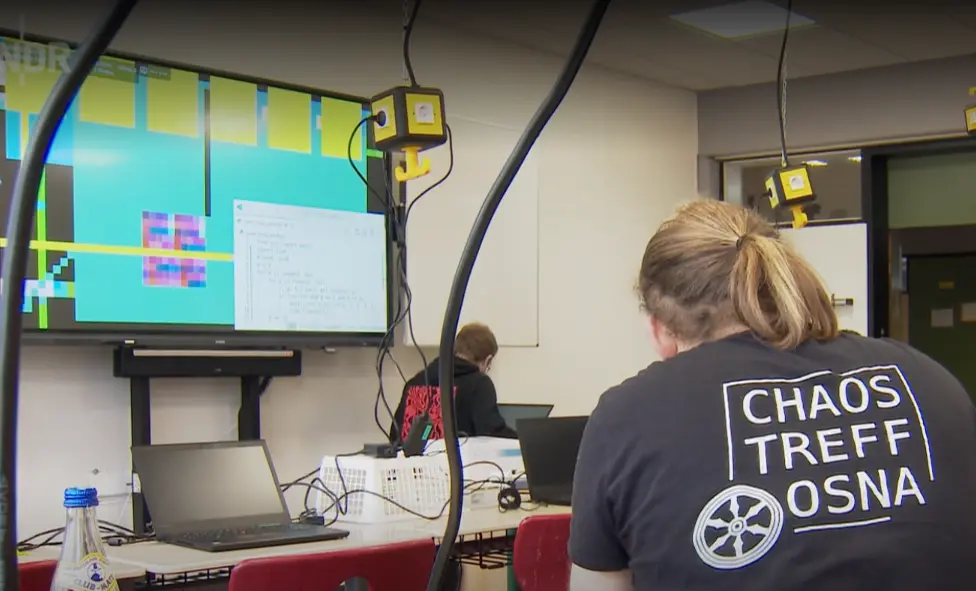

On November 9, 2025, we held a workshop at the Gesamtschule Osnabrück-Schinkel.
During the evacuation due to the bomb disposal in the Lokviertel, participants had the opportunity to learn the basics of programming with Python and get creative with "Pixelflut".

The workshop was a great success. Many of the participants had little or no prior experience with programming.

The NDR was also on site and reported on the event (german only):

https://www.ndr.de/fernsehen/sendungen/hallo_niedersachsen/bombenraeumung-in-osnabrueck-14000-muessen-haeuser-verlassen,hallonds-3450.html
